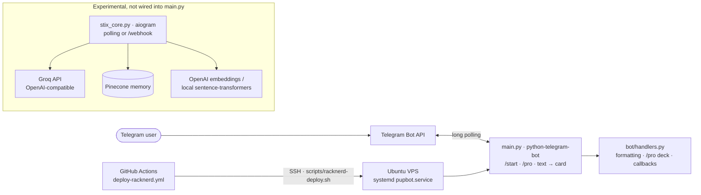

# STIX MAGIC Text Bot

**Telegram bot that turns plain text into styled STIX MAGIC message cards**

[](https://github.com/FriskyDevelopments/STIX-MAGIC--Magic-text-bot/actions/workflows/deploy-racknerd.yml)  

A Telegram bot (runtime name **Pupbot**) for the STIX MAGIC community. Send it plain text and it replies with an HTML-formatted "STIX PROCESSING" card: your text in a blockquote framed by random magic emojis. `/start` shows the welcome message, and `/pro` opens a paginated "Features" deck navigated in place with inline-keyboard arrows. The production entry point is `main.py` (python-telegram-bot, long polling). The repo also contains `stix_core.py`, an experimental standalone **aiogram** bot that isn't wired into `main.py`. It generates text "triads" through Groq's OpenAI-compatible API, keeps retrieval memory in Pinecone using OpenAI or local sentence-transformer embeddings, and can run as a webhook server. It's for STIX MAGIC users who want prettier text posts in Telegram.

## Architecture



## Stack

- Python 3.12 (`runtime.txt`), python-telegram-bot, python-dotenv, requests
- Experimental core: aiogram, aiohttp, openai SDK (Groq), Pinecone, sentence-transformers
- Deploy: systemd on an Ubuntu VPS over SSH (GitHub Actions)

## Project structure

```text
main.py                 entry point: token lookup, local-dev webhook suppression, handlers, polling
bot/handlers.py         /start, /pro deck, callback router, text → card formatter
stix_core.py            experimental aiogram bot (Groq + Pinecone), not imported by main.py
deploy/systemd/         pupbot.service unit
scripts/                racknerd-bootstrap.sh, racknerd-deploy.sh (+ deprecated OCI scripts)
.github/workflows/      deploy-racknerd.yml, oci-a1-watchdog.yml (deprecated)
Procfile, Dockerfile    legacy launchers
```

## Local development

Local run:

```bash
cp .env.example .env      # fill in a bot token
pip install -r requirements.txt
python main.py
```

| Command | What it does |
|---|---|
| `/start` | Welcome message |
| `/pro` | Paginated features deck with in-place navigation |
| *(any text)* | Replies with the formatted STIX MAGIC card |

With `STIX_LOCAL_DEV` set, `main.py` keeps clearing any registered webhook, so local polling doesn't collide with production.

## Environment variables

Names only.

**Bot (main.py)**

- `STIX_BOT_TOKEN`
- `BOT_TOKEN_DEV`
- `TELEGRAM_BOT_TOKEN`
- `STIX_LOCAL_DEV`
- `STIX_WEBHOOK_SUPPRESS_INTERVAL_SEC`

**Experimental core (stix_core.py)**

`APP_ENV`, `WEBHOOK_URL`, `PORT`, `MINI_APP_URL`, `GROQ_API_KEY`, `OPENAI_API_KEY`, `OPENAI_EMBED_MODEL`, `PINECONE_API_KEY`, `PINECONE_INDEX_NAME`, `PINECONE_TOP_K`, `LOCAL_EMBEDDINGS`, `LOCAL_EMBEDDING_MODEL`

## Deploy

The bot runs on an Ubuntu VPS under systemd (`deploy/systemd/pupbot.service`, with env loaded from an `EnvironmentFile`):

1. On a fresh server, run `scripts/racknerd-bootstrap.sh` as root. It creates the service user, venv and unit.
2. Put the bot token in the service's env file, then `systemctl start pupbot`.
3. Set the GitHub secrets `RACKNERD_HOST` and `RACKNERD_SSH_KEY` (optionally `RACKNERD_DEPLOY_PATH`). The **Deploy Pupbot (RackNerd)** workflow then redeploys on pushes to `main` that touch the bot code. Disable it with the repo variable `RACKNERD_DEPLOY_ENABLED=false`.

`Procfile` (Heroku-style) and the Oracle A1 watchdog are legacy or deprecated. The `Dockerfile` expects `pyproject.toml`/`poetry.lock`, which aren't in the repo, so it won't build as-is.

## Related repos

- [stixmagic-web](https://github.com/FriskyDevelopments/stixmagic-web): web platform
- [stixmagic-bot](https://github.com/FriskyDevelopments/stixmagic-bot): sticker bot
